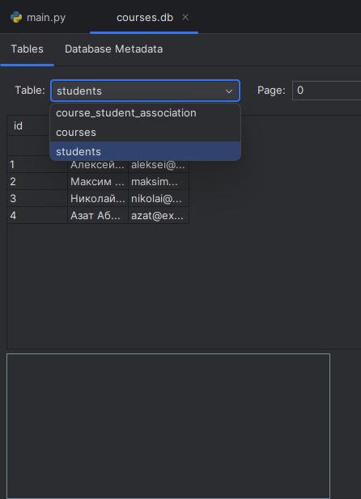

# lab17  

## Задание
Спроектируйте БД с использованием crow’s foot notation.
Напишите модели данных, создайте и заполните БД с помощью SQLAlchemy.
Напишите запросы для выборки и анализа данных из БД.
Оформите отчёт в README.md. Отчёт должен содержать:
## Проделанная работа
По своему варианту (`2`), создал и заполнил БД используя SQLAlchemy

## Скриншоты

## Список использованных источников
[лаба](https://evil-teacher.on.fleek.co/prog_pm/term2/lab17/)   

